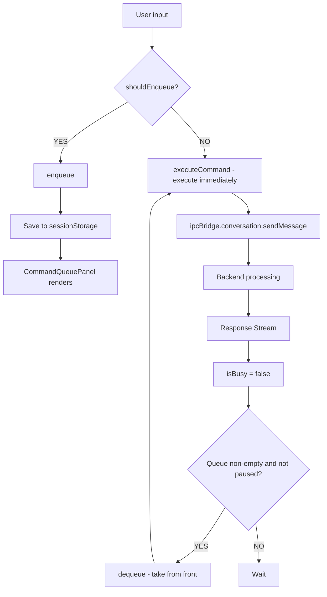
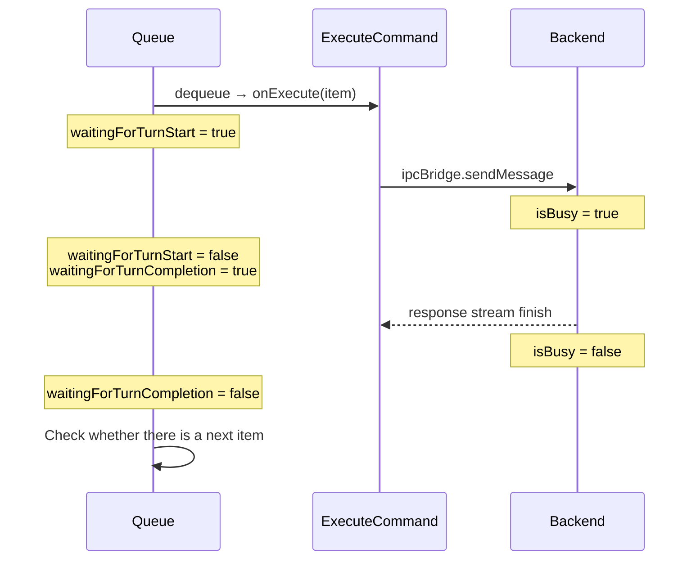
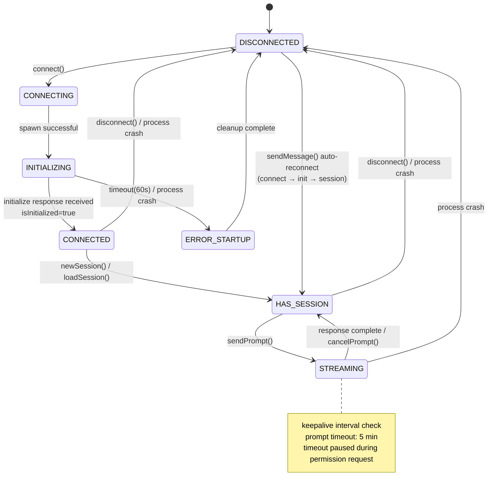
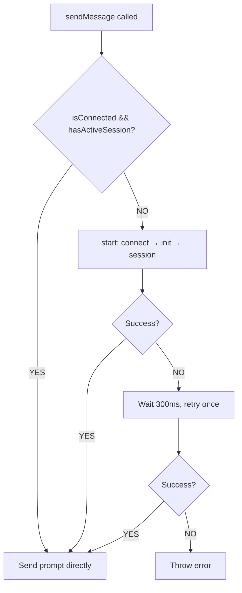
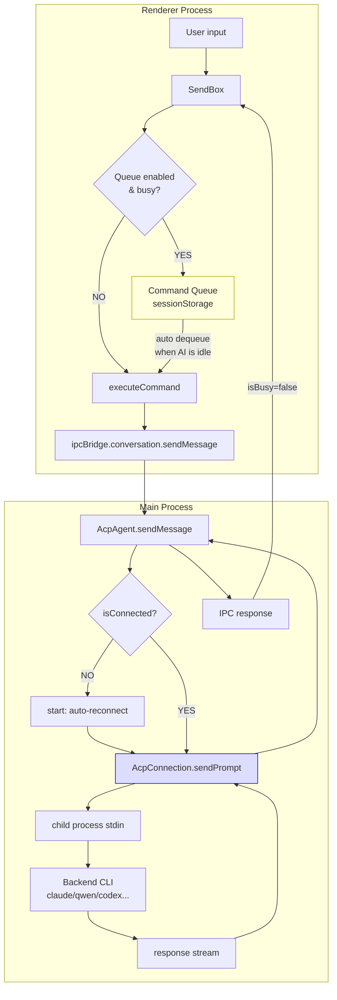

# Conversation Command Queue & ACP State Machine Analysis

## 1. Conversation Command Queue

### 1.1 What Is It? What Problem Does It Solve?

The Command Queue is a user-controlled command buffering mechanism. When the AI is processing a previous message, any new message the user sends is not dropped - instead it enters the queue and waits to be executed in order.

**Problem without the Queue**: When the AI is busy, sending a message only shows "conversation in progress" and the message is lost.

**Disabled by default** - must be manually enabled in Settings > System > "Enable Command Queue".

### 1.2 Core Files

| File                                                                       | Responsibility                                                        |
| -------------------------------------------------------------------------- | --------------------------------------------------------------------- |
| `src/renderer/pages/conversation/platforms/useConversationCommandQueue.ts` | Core hook, 726 lines, contains all queue logic                        |
| `src/renderer/components/chat/CommandQueuePanel.tsx`                       | Queue UI panel - supports editing, drag-and-drop, and deletion        |
| `src/renderer/hooks/mcp/messageQueue.ts`                                   | MCP toast message queue (separate mechanism, not the Command Queue)   |

### 1.3 Data Structures and Constraints

```typescript
type ConversationCommandQueueItem = {
  id: string; // UUID
  input: string; // command text
  files: string[]; // attachment paths
  createdAt: number; // timestamp
};

type ConversationCommandQueueState = {
  items: ConversationCommandQueueItem[];
  isPaused: boolean; // user can pause auto-execution
};
```

| Constraint              | Value                               |
| ----------------------- | ----------------------------------- |
| Max queue length        | 20 items                            |
| Max chars per item      | 20,000                              |
| Max attachments per item| 50                                  |
| Max queue storage       | 256 KB                              |
| Persistence             | sessionStorage (per conversation)   |

### 1.4 Enqueue Conditions

```typescript
shouldEnqueueConversationCommand({ enabled, isBusy, hasPendingCommands }) = enabled && (isBusy || hasPendingCommands);
```

All three conditions must be met for a message to be enqueued:

1. The global toggle is enabled
2. The AI is busy **or** the queue already contains pending commands

### 1.5 Position in the Message Pipeline



### 1.6 Full Flow

#### Enqueue Phase

1. User sends a message in SendBox
2. `onSendHandler` checks `shouldEnqueueConversationCommand()`
3. Validates constraints (empty input, length, file count, queue full, total size)
4. Validation fails → `Message.warning()` notification
5. Validation passes → creates item (UUID + timestamp), appends to queue, persists to sessionStorage

#### Dequeue Phase (automatic)

1. `useEffect` watches: `[items, isBusy, enabled, isHydrated, isInteractionLocked]`
2. All conditions must be met:
   - Queue is enabled
   - Component is hydrated (restored from storage)
   - Not paused
   - AI is idle (`isBusy = false`)
   - Not interaction-locked (user is not editing or dragging)
3. Takes item from front → sets `waitingForTurnStart = true` → calls `onExecute()`
4. Execution fails → restores item to front of queue → automatically pauses queue

#### Turn Tracking



### 1.7 Cross-Platform Support

The Queue mechanism is integrated via SendBox and is supported on all of the following platforms:

- Nanobot (`NanobotSendBox.tsx`)
- Gemini (`GeminiSendBox.tsx`)
- ACP (`AcpSendBox.tsx`)
- OpenClaw (`OpenClawSendBox.tsx`)
- Aionrs

---

## 2. ACP State Management

### 2.1 Core Files

| File                                        | Responsibility                        |
| ------------------------------------------- | ------------------------------------- |
| `src/process/agent/acp/AcpConnection.ts`    | Core state machine, 1192 lines        |
| `src/process/agent/acp/index.ts` (AcpAgent) | Higher-level Agent wrapper            |
| `src/process/agent/acp/acpConnectors.ts`    | Backend-specific spawn logic          |
| `src/common/types/acpTypes.ts`              | Type definitions                      |

### 2.2 State Variables

ACP does not use a single enum to represent state. Instead, state is determined implicitly through a **combination of multiple independent flags**:

| Variable          | Type                   | Meaning                         |
| ----------------- | ---------------------- | ------------------------------- |
| `child`           | `ChildProcess \| null` | Reference to the child process  |
| `sessionId`       | `string \| null`       | Active session ID               |
| `isInitialized`   | `boolean`              | Whether the protocol handshake is complete |
| `isSetupComplete` | `boolean`              | Whether the startup phase is complete |
| `backend`         | `AcpBackend \| null`   | Backend type                    |
| `pendingRequests` | `Map`                  | In-progress RPC requests        |

Derived properties:

```typescript
get isConnected(): boolean {
  return this.child !== null && !this.child.killed;
}
get hasActiveSession(): boolean {
  return this.sessionId !== null;
}
```

### 2.3 Logical States

| State             | Condition combination                                      | Meaning                                       |
| ----------------- | ---------------------------------------------------------- | --------------------------------------------- |
| **DISCONNECTED**  | child=null, sessionId=null, isInitialized=false            | No process, no session                        |
| **CONNECTING**    | child≠null, isInitialized=false                            | Process is starting up                        |
| **INITIALIZING**  | child running, initialize request in flight                | Protocol handshake in progress (60s timeout)  |
| **CONNECTED**     | isConnected=true, isInitialized=true, isSetupComplete=true | Ready, waiting for a session to be created    |
| **HAS_SESSION**   | CONNECTED + sessionId≠null                                 | Can send messages                             |
| **STREAMING**     | HAS_SESSION + pendingRequests.size>0                       | Turn in progress                              |
| **ERROR_STARTUP** | child exited, isSetupComplete=false                        | Crashed during startup phase                  |
| **ERROR_RUNTIME** | child exited, isSetupComplete=true                         | Crashed at runtime                            |

### 2.4 State Transition Diagram



### 2.5 Key Methods and Line Numbers

| Method                        | Lines     | Responsibility                        |
| ----------------------------- | --------- | ------------------------------------- |
| `connect()`                   | 204-265   | Initiate connection                   |
| `doConnect()`                 | 267-336   | Dispatch spawn by backend             |
| `setupChildProcessHandlers()` | 338-483   | Set up protocol handlers              |
| `initialize()`                | 852-867   | Send initialize RPC                   |
| `newSession()`                | 885-929   | Create a new session                  |
| `loadSession()`               | 939-956   | Restore an existing session           |
| `sendPrompt()`                | 1006-1024 | Send user message                     |
| `handleMessage()`             | 705-745   | Receive response                      |
| `handleProcessExit()`         | 489-513   | Process exit cleanup                  |
| `disconnect()`                | 1126-1139 | User-initiated disconnect             |
| `cancelPrompt()`              | 1031-1051 | Cancel the current turn               |

### 2.6 Stability Issue Analysis

#### Issue 1: No concurrent prompt protection

`sendPrompt()` has no re-entrancy guard. If called again before the previous prompt completes, two requests are sent on the same process stdin and protocol-layer behavior is undefined.

- **Location**: `AcpConnection.ts:1006`
- **Risk**: High (if called programmatically)
- **Current state**: Relies on the UI layer not calling it twice in succession

#### Issue 2: Permission timeout race condition

When a permission request blocks a prompt, the timeout is paused. However, if the permission dialog is forgotten for more than 30 minutes, resuming may trigger a spurious timeout.

- **Location**: `AcpConnection.ts:610-618`, `index.ts:1162-1168`

#### Issue 3: Process state detection timing

```typescript
private isChildAlive(): boolean {
  return this.child !== null && !this.child.killed &&
         this.child.exitCode === null && this.child.signalCode === null;
}
```

There is a small window between Node.js firing the `exit` event and `exitCode`/`signalCode` being set on the process object. The keepalive check may read stale state during this window.

- **Location**: `AcpConnection.ts:657-659`

#### Issue 4: Duplicate permission request overwrites pending entry

If the agent sends two permission requests for the same `toolCallId`, the second overwrites the first pending entry, causing the first resolve callback to be lost.

- **Location**: `index.ts:1140-1149`

#### Issue 5: Fragile session ID fallback logic

```typescript
this.sessionId = response.sessionId || sessionId;
```

If the backend returns a response with an unexpected format (sessionId is undefined), `||` falls back to the passed-in sessionId. But if response itself is null/undefined, this throws an exception.

- **Location**: `AcpConnection.ts:949`

#### Issue 6: Setter methods do not validate connection state

`setSessionMode()`, `setModel()`, and `setConfigOption()` only check whether `sessionId` exists - they do not check `isConnected` or whether the process is still alive.

- **Location**: `AcpConnection.ts:1053-1091`
- **Risk**: Sending messages to a dead process

#### Issue 7: Dual model cache inconsistency

`setModel()` updates both `this.models` and `this.configOptions` caches simultaneously. If one update fails, the two caches end up in an inconsistent state.

- **Location**: `AcpConnection.ts:1075-1086`

### 2.7 Auto-Reconnect Mechanism

When `sendMessage()` detects `!isConnected || !hasActiveSession`, it automatically calls `start()` to execute the full connect → initialize → newSession/loadSession sequence. After the first failure there is one retry with a 300ms delay.



---

## 3. Relationship Between the Two in the Overall Architecture



The Command Queue lives in the **UI layer of the Renderer process** and is responsible for buffering commands on the user side. The ACP state machine lives in the **Main process** and manages the connection and protocol communication with the backend CLI. The two are connected via the IPC bridge - the Queue watches the `isBusy` state to decide when to dequeue and execute the next command.
