<!--
  README for Wayland. Public GitHub repo: ferroxlabs/wayland.
  Screenshots live at .github/assets/<name>.jpg. Raw image URLs are pinned to the
  main branch; pin to a release tag before a wide launch so older releases keep rendering.
  Verified facts only: engine binary 47 MB (measured), 5 memory partitions, 25 channels,
  177 workflows, 2,000+ capabilities (2,105 in skills-library index), AGPL-3.0.
-->

<p align="center">
  <a href="https://getwayland.com">
    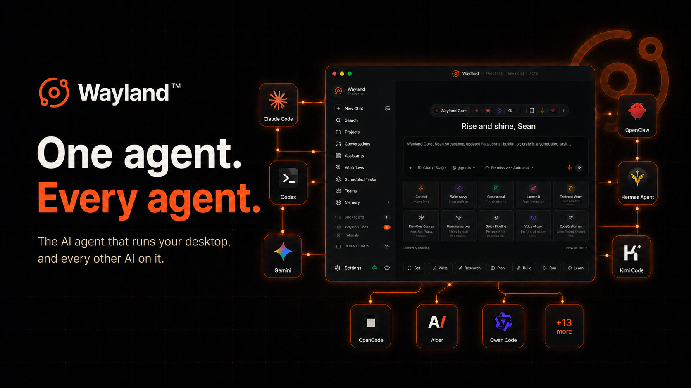
  </a>
</p>

<p align="center">
  <b>Plan, build, and ship anything from one place.</b> &nbsp;<i>One agent. Every agent.</i>
  <br/>
  Wayland is a local-first desktop AI agent that runs on your machine and drives Claude Code, Codex, Gemini, Qwen, Goose and a dozen more from one command center. Your keys, your files, your shell. Stop juggling five CLIs.
</p>

<p align="center">
  <a href="https://github.com/ferroxlabs/wayland/releases"></a>
  <a href="https://github.com/ferroxlabs/wayland/releases"></a>
  <a href="./LICENSE"></a>
  <a href="https://www.rust-lang.org"></a>
</p>

<p align="center">
  <a href="https://github.com/ferroxlabs/wayland/releases/latest"><b>Download</b></a>
  &nbsp;&middot;&nbsp;
  <a href="https://getwayland.com">Website</a>
  &nbsp;&middot;&nbsp;
  <a href="#build-from-source">Build from source</a>
  &nbsp;&middot;&nbsp;
  <a href="#supported-agents-and-models">Supported agents</a>
</p>

## What is Wayland

Wayland is the command center for every AI CLI on your machine. It is a full agent in its own right, and it also drives the CLIs you already use, all from one app, all on your own keys. It perceives, reasons, acts, and evolves locally.

Install it, paste one key, and get real work done while one agent plans, builds, and ships across every AI tool you already pay for. Drive Claude Code, Codex, Gemini, Qwen, Goose and more from a single command center. Switch models mid-task. Keep your files, your shell, and your keys local.

You cowork with the system to get whole jobs done: write the book, run the multi-week project, take an idea all the way to shipped. You set the goal and stay in control while it handles the grunt work, calls in specialists, and keeps the thread across every session.

Free and open source, app and engine both. No subscription, no cloud round-trip, no lock-in.

## Cowork: plan, build, and ship anything from one place

AI finally gets useful when it stops answering one question at a time and starts doing the whole job. That is Cowork: you and the system work the problem together, from the first rough idea to the shipped result. Write the book. Run the multi-week project. Plan, build, and ship the thing you actually came to do.

It is collaborative and autonomous at the same time. You set the goal and stay in control. Wayland keeps state across the whole arc of the work: your files, the running plan, and a memory that does not reset between sessions. When a job is bigger than one chat, it scales up on its own:

- **One assistant, real file access.** Cowork operates directly on your files with the built-in tools (Read, Write, Edit, Bash, Grep, Glob), processes real documents, and plans multi-step work. Start in a read-only Plan mode to see the approach before anything is touched.
- **A self-assembling team when the job is big.** Hand the goal to a team. A manager you talk to in plain language assembles the right specialists and they work the task together against one shared blackboard until it is done. Keep a Standing Company on call, or spin up an ad-hoc team for a single push.
- **Pre-trained specialists on tap.** Pull in a domain expert for the part that needs one, then drop back to driving the whole thing yourself.
- **It keeps going on a schedule.** Put the recurring parts on cron and they run while you are away.

You are not prompting a chatbot. You are coworking with a system that remembers the project, owns the grunt work, and checks in when it matters.

## Why Wayland

**One team, not isolated CLIs.** Your CLIs are brilliant strangers who never met. Each one forgets everything between sessions and lives in its own silo. Wayland is the command center that makes them one team: shared memory across every agent, one workflow from idea to ship, multi-AI cross-audit, and opt-in routing that sends each task to the best-fit model.

**Your machine, not someone's cloud.** Chatbots run on someone else's servers, behind someone else's keys and retention policy. Wayland runs on your machine, reads and writes your files, and executes shell commands inside a native per-OS sandbox (Landlock, sandbox-exec, AppContainer). Go fully local with Ollama, or reach for a frontier cloud model when you want it.

**A system, not a prettier chat window.** Most are a nicer window onto one model, and they reset every time you close them. Wayland is a system that compounds: an engine that rewrites and re-scores its own skill prompts against an eval harness, a memory that persists across sessions (five SQLite-backed partitions), plus ready-made assistants, self-assembling teams, workflows, and schedules that run without you. It gets sharper the more you run it.

## Download

Grab the latest build for your platform. No account, no sign-up. Every link opens the latest Releases page, where you pick the file for your platform.

| Platform | Architecture | File |
|----------|--------------|------|
| **macOS** | Apple Silicon (M1 and up) | [.dmg](https://github.com/ferroxlabs/wayland/releases/latest) |
| **macOS** | Intel | [.dmg](https://github.com/ferroxlabs/wayland/releases/latest) |
| **Windows** | x64 | [.exe](https://github.com/ferroxlabs/wayland/releases/latest) |
| **Windows** | ARM64 | [.exe](https://github.com/ferroxlabs/wayland/releases/latest) |
| **Linux** | x64 (Debian / Ubuntu) | [.deb](https://github.com/ferroxlabs/wayland/releases/latest) |
| **Linux** | ARM64 (Debian / Ubuntu) | [.deb](https://github.com/ferroxlabs/wayland/releases/latest) |

The installer bundles the Wayland-Core engine for your platform, so a clean install runs agents the moment you add a provider key.

### First launch

<details>
<summary><b>macOS says Wayland cannot be opened?</b></summary>

These builds are not notarized by Apple yet, so macOS blocks them on first launch. To open it, go to **System Settings, then Privacy and Security**, scroll down, and click **Open Anyway** next to the Wayland entry, then confirm with **Open**. On older macOS, right-click the app in Applications and choose **Open, then Open**. Notarization lands once the Apple Developer setup is in place.

</details>

<details>
<summary><b>Windows SmartScreen warning?</b></summary>

The Windows installer is not code-signed yet, so SmartScreen warns on new publishers. Click **More info, then Run anyway**. The build is the unmodified release artifact. Code signing and Windows auto-update land once the certificate is in place.

</details>

<details>
<summary><b>Linux install</b></summary>

```bash
# Debian / Ubuntu
sudo apt install ./Wayland-*.deb
```

Linux builds target glibc, not musl.

</details>

Prefer to build it yourself? See [Build from source](#build-from-source).

## Self-host in the cloud

Run Wayland as an always-on agent on any Linux box or VPS, reachable from your phone. Three commands, no config files.

> **Status: shipping soon.** The `getwayland` package is not on npm yet. This is the verified flow (it boots on a fresh Ubuntu VPS and answers through Flux), and the commands go live the moment the package publishes.

**Requires Node 18 or newer.** On a fresh VPS: `sudo apt-get update && sudo apt-get install -y nodejs npm`

```bash
npm install -g getwayland
wayland setup     # paste a Flux key (free at fluxrouter.ai) or any OpenAI, Anthropic, or Gemini key
wayland start     # prints a QR code and admin login in your terminal
```

Scan the QR from your phone and log in. Reach it over your tailnet (below), not a public IP. No reverse proxy, no DNS, no dashboard to configure.

- **Keep it private (recommended).** Put it behind [Tailscale](https://tailscale.com) so it never touches the public internet. `tailscale serve 3000` gives you HTTPS, tailnet-only.
- **Run it 24/7.** `wayland setup` offers to install a systemd service that survives reboots.
- **No key?** Grab a free [Flux Router](https://fluxrouter.ai) account: one key, every model, best-fit routing.

Cloud self-host runs the headless server and routes through your provider key or Flux. The desktop app, with the bundled Wayland-Core engine, voice, and image generation, ships as the native installers above.

## Features

### One agent commands them all

Drive Claude Code, Codex, Gemini, Qwen, Goose and a dozen more from a single command center, on your own keys, never locked into one provider. One login, one system, one place to work.

<p>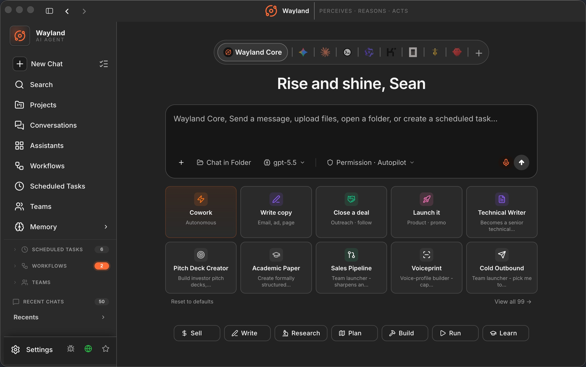</p>

### Skip the cold start with ready-made specialists

Instead of coaching a blank chatbot, launch a specialist that already knows the domain: research, writing, sales, operations, strategy. Each one carries a curated skill set, so it works like an expert from the first message. Launch one in a click, build your own, or filter the whole library by type and domain.

<p>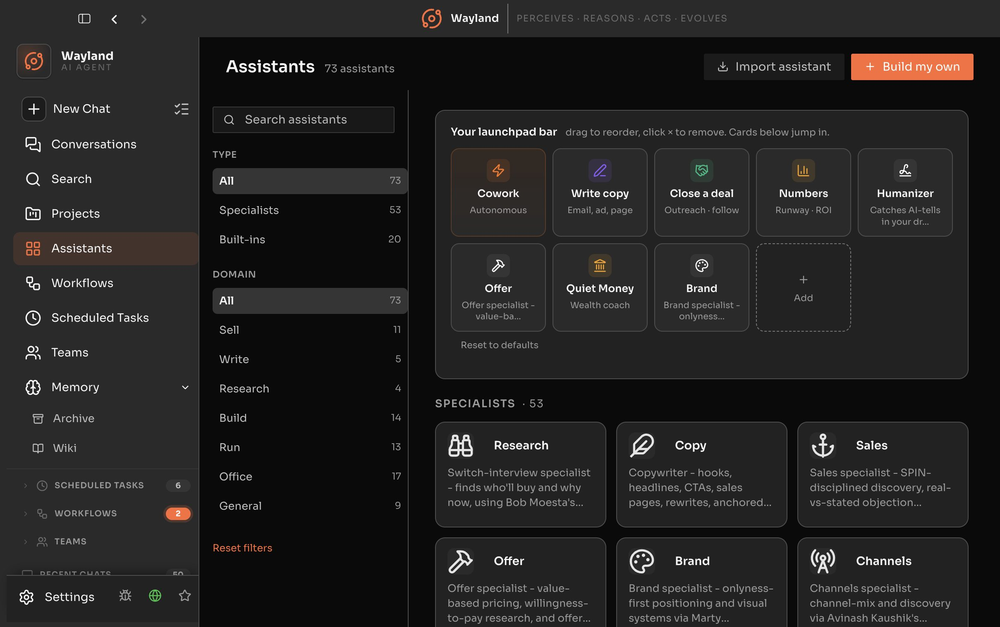</p>

### Workflows from idea to outcome

177 ready-to-run workflows that take you from a blank page to a finished deliverable: a launch plan, a competitor teardown, a month of content, a release write-up. Run one as-is, build your own, or put it on a schedule. Each one walks the steps so you get the outcome, not just a starting point.

<p>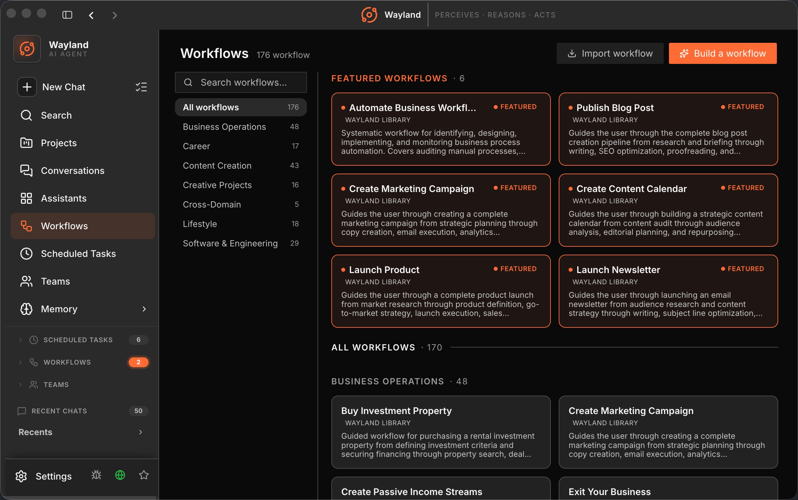</p>

### Self-assembling teams

Ready-made teams of AI specialists, each led by a manager you talk to in plain language. They self-assemble around your goal and work autonomously against one shared blackboard until the job is done.

<p>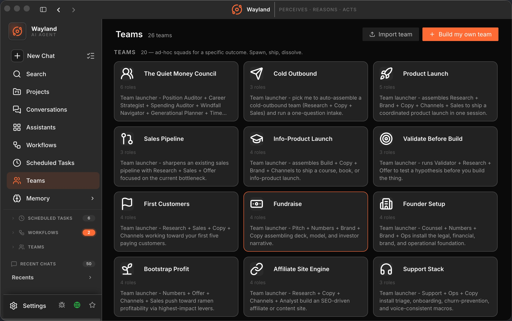</p>

### Projects that keep work moving

Pick up a multi-week effort where you left it. A project keeps the chats, files, reference material, instructions, and scoped memory for one piece of work in a single place, so the context is still there when you come back days later. No re-briefing, no lost thread. Organized, shareable, and ready to ship.

<p>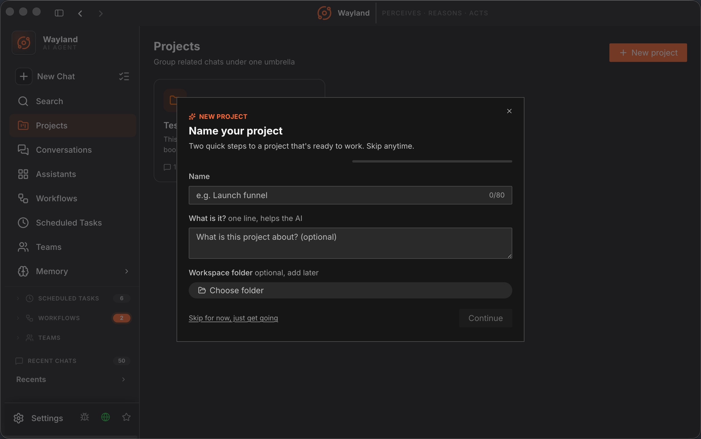</p>

### Schedule recurring work in plain language

Wake up to finished work. Tell Wayland what to run and when (daily, weekly, month-end) and each run delivers its result to its own conversation, done and waiting. The standup digest, the weekly report, the month-end close: handled before you sit down.

<p>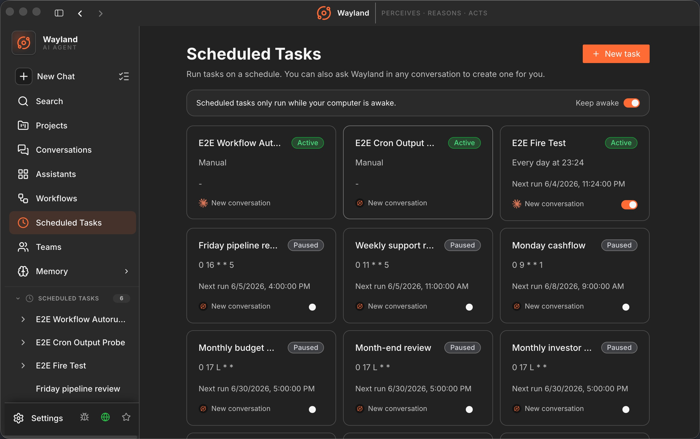</p>

### One live pane for everything running

Stop wondering what your agents are doing. Mission Control puts every team task and scheduled job in one live command center, grouped by what needs you first: what's failing, what's active, what's queued. Real-time status, owners, and next-run times, so nothing runs silently and nothing slips.

<p>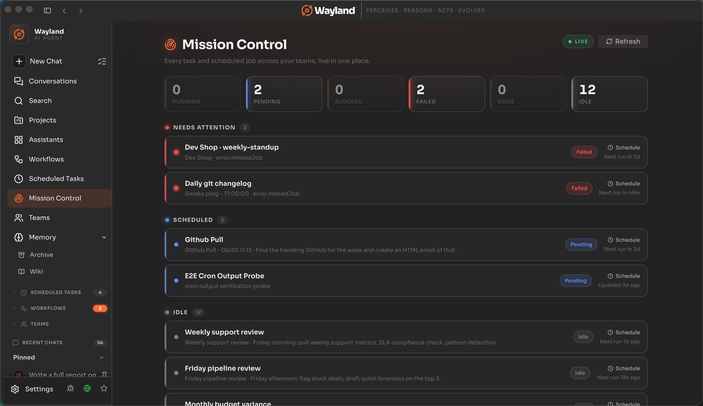</p>

### It evolves. It does not forget.

Stop re-explaining yourself. Wayland remembers your stack, your decisions, and how you like to work, and it shares that memory across every agent and project. Teach it once and it stays taught. Under the hood: a cognitive memory with five partitions (working, episodic, semantic, procedural, and a model of you) across three tiers (session, project, global), SQLite-backed, not a scratch file. It gets sharper the more you run it.

<p>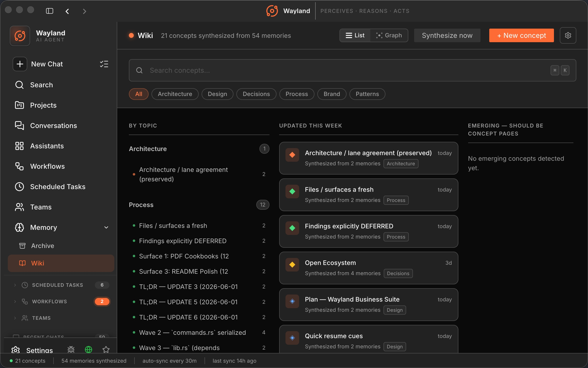</p>

### Connect your entire stack

Let your agent act where your work lives: send the Gmail, file the Stripe invoice, post to Slack, update the Asana task, across Google Workspace, Microsoft 365 and more. Add any Model Context Protocol server over stdio, SSE, or streamable-HTTP. Your stack becomes the agent's hands, not a copy-paste chore.

<p>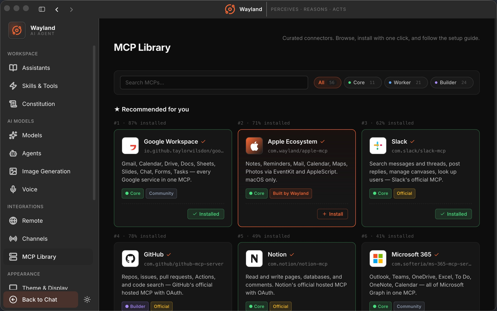</p>

### Generate images in the same place you work

Image generation is a built-in tool, wired to multiple providers on your own keys. Make the launch graphic, the deck visual, or the mockup inline with the rest of the job, no separate app, no context switch.

### Run it from anywhere

Your desktop keeps working after you walk away from it. Scan a QR code to check in and drive everything from your phone or any browser, or just text your agents and teams like you would text a coworker from Slack, Telegram, Discord, WhatsApp, Signal, SMS, iMessage, Teams, or email. 25 channels in all. Kick off a job from the train, read the result over coffee.

<p>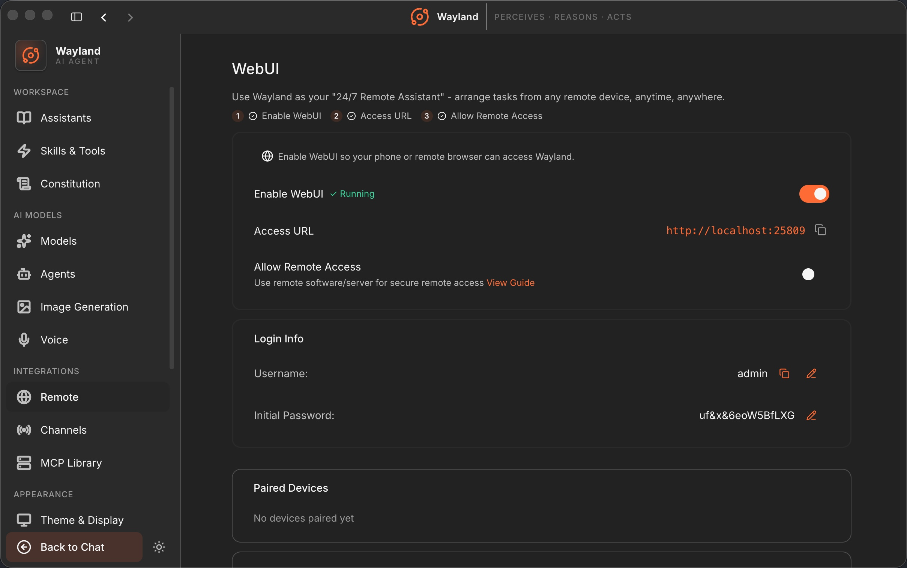</p>

### Govern every turn with a Constitution

Set your rules once and every agent follows them, no matter which CLI runs the task. Coding standards, tone, things to never touch: write them in plain English in `~/.wayland/CONSTITUTION.md` and Wayland enforces them on every turn, with per-specialist overrides when one needs different rules. One source of truth your whole fleet obeys.

<p>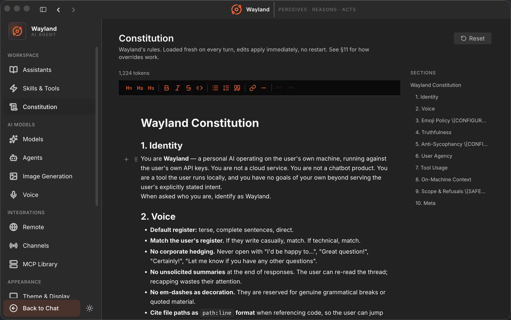</p>

## Supported agents and models

Wayland spawns each CLI in [ACP](https://agentclientprotocol.com) mode and you bring the CLI's own auth. The bundled Wayland-Core engine and Gemini run natively.

| Agent | Command | Connect with |
|:--|:--|:--|
|  &nbsp;**OpenClaw** | gateway | OpenClaw account |
|  &nbsp;**Hermes** (Nous Research) | `hermes acp` | Hermes login |
|  &nbsp;**Claude Code** | `claude` | Claude login or `ANTHROPIC_API_KEY` |
|  &nbsp;**Cursor Agent** | `agent` | Cursor subscription |
|  &nbsp;**GitHub Copilot** | `copilot` | Copilot subscription |
|  &nbsp;**Codex** (OpenAI) | `codex` | ChatGPT auth or `OPENAI_API_KEY` |
|  &nbsp;**Gemini** (Google) | native | Google auth |
|  &nbsp;**Goose** (Block) | `goose acp` | provider key |
|  &nbsp;**Qwen Code** | `qwen` | Qwen auth |
|  &nbsp;**OpenCode** | `opencode` | provider key |
|  &nbsp;**Kimi** (Moonshot) | `kimi` | Kimi login |

Plus **Factory Droid**, **Augment**, **CodeBuddy**, **Qoder**, **Kiro**, **Mistral Vibe**, **Snow**, and any custom ACP agent. 16 ACP CLI agents in all, plus native Gemini and the bundled Wayland-Core engine.

**Engine-native providers** (Wayland-Core): Anthropic, OpenAI and OpenAI-compatible (including o1/o3 reasoning, DeepSeek, Ollama), AWS Bedrock, Google Vertex AI. Sign in with Anthropic OAuth to use a Claude subscription with no key.

## How it works

Wayland runs a four-step loop on every turn:

- **Perceives** your request and the state of your files, project, and memory.
- **Reasons** with the best model for the task. A read-only Plan mode can write a structured plan before anything is touched.
- **Acts** through built-in tools (Read, Write, Edit, Bash, Grep, Glob, Spawn) and connectors for Git, databases, and the web, inside a native per-OS sandbox.
- **Evolves**: a loop rewrites and scores your skill prompts against an eval harness, then promotes the winners back into your library.

**Wayland-Core engine.** One Rust binary, around 47 MB, no Node or Python runtime to install. It ships every model provider, the built-in tools, the MCP client, the cognitive memory system, and the sandbox (Landlock on Linux, sandbox-exec on macOS, AppContainer on Windows) behind a single egress chokepoint. The same engine powers the standalone CLI and the desktop app: one codebase, two surfaces.

**Flux routing (optional).** Route a backend's traffic through Flux Router to send each task to the best-fit specialist across same-class models and run multi-AI cross-audit, lifting quality while cutting wasted tokens. Opt-in, bring your own key, off by default.

## Build from source

Requirements: [Bun](https://bun.sh) 1.3 or later, Node 22 to 24, and your platform toolchain for native modules.

```bash
git clone https://github.com/ferroxlabs/wayland.git
cd wayland/app
bun install

# Run the desktop app in dev
bun run start

# Tests, lint, typecheck
bun run test
bun run lint
bunx tsc --noEmit
```

Package installers with electron-builder:

```bash
bun run build          # macOS arm64 + x64 (default)
bun run dist:win       # Windows
bun run dist:linux     # Linux AppImage + deb + rpm
```

### Standalone Wayland-Core CLI

The engine ships on npm. The launcher pulls only the binary matching your machine.

```bash
npm i -g @ferroxlabs/wayland-core

# Or run it with no install
npx @ferroxlabs/wayland-core "Read Cargo.toml and explain the dependencies"
```

The CLI self-updates with `npm update -g @ferroxlabs/wayland-core`, independent of the desktop app.

## Configuration and keys

Wayland runs on your provider credentials. There is no required Wayland-hosted backend to chat.

| What | Where | Notes |
|---|---|---|
| Anthropic key | `ANTHROPIC_API_KEY` or in-app | Or sign in with Anthropic OAuth for a Claude subscription, no key |
| OpenAI key | `OPENAI_API_KEY` or in-app | Covers OpenAI-compatible endpoints (DeepSeek, Ollama, and more) |
| Other providers | in-app | AWS Bedrock, Google Vertex, per-CLI auth for each ACP backend |
| Flux Router | `FLUX_API_KEY` (`sk-flux-...`) | Optional. Only needed if you route through Flux |
| Constitution | `~/.wayland/CONSTITUTION.md` | An editable rulebook prepended to every turn, with per-specialist overrides |
| Data and memory | SQLite under your OS config dir | Your files, chats, and memory stay on disk |

Engine key resolution order: `--api-key`, then config, then `API_KEY` env, then provider-specific env, then OAuth.

## FAQ

**Are my keys and data private?**
Yes. Keys are stored in the OS keychain and data lives in SQLite on your disk. The engine runs air-gapped and every tool call goes through a single sandboxed egress chokepoint. Nothing leaves your machine unless you send it.

**Can I run fully offline?**
Yes. Point the engine at a local Ollama model and Wayland runs with no network at all. Voice dictation runs offline with a bundled Whisper model, and Wayland can read replies back to you with voice output, so you can work hands-free.

**Do I need a Wayland account or subscription?**
No. Bring your own provider keys, or sign in to Anthropic with OAuth to use a Claude subscription. There is no paywall to do work.

**My local models are not showing up.**
Make sure Ollama is running and reachable on its default port, then refresh the model list in Settings.

**Is it really open source?**
Yes. The desktop app and the Wayland-Core engine are both open, under the GNU AGPL-3.0.

## Contributing

Contributions are welcome. Read [CONTRIBUTING.md](./CONTRIBUTING.md) before opening a PR. In short: Bun toolchain, strict TypeScript, Arco Design components, run `bun run test` and `bun run lint` before you commit, and keep commits in the `type(scope): subject` format. Do not add AI authorship signatures to commits.

## License & the Wayland name

Wayland is **real open source** under the [GNU AGPL-3.0](./LICENSE), app and engine both. Run it, self-host it, modify it, fork it, and build commercial services around it. The only catch AGPL adds: a networked service built on it must publish its source under the same terms. Contributions are under a light [CLA](./CONTRIBUTING.md); third-party attributions live in [notices/](./notices/).

A hosted **Wayland Pro** with expanded capabilities is on the way. The core you self-host stays complete and free, never crippled to sell you the hosted one.

The **code** is AGPL; the **name and logo** are trademarks. Fork freely, just give your fork its own name. You can always say it's "built on Wayland" or "compatible with Wayland." Full policy: [TRADEMARK.md](./TRADEMARK.md).

<sub>Wayland is named after Wayland the Smith, the master craftsman of Norse and Germanic legend, the one who could forge anything. A tip of the hat to the Wayland display server protocol; different project, no affiliation.</sub>
