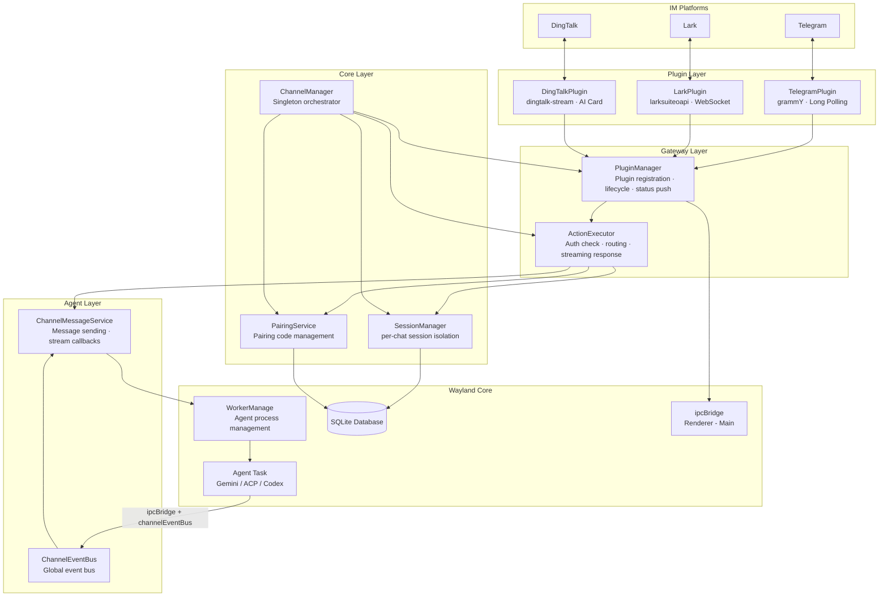
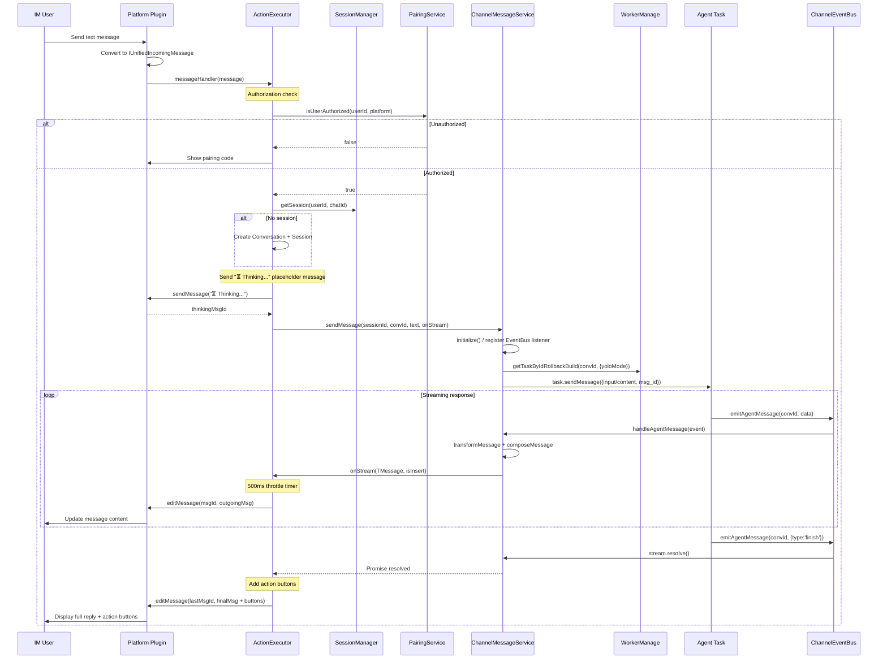

# Channels Architecture

## 1. Overview

Channels is Wayland's multi-platform AI assistant framework, exposing Wayland's AI capabilities (Gemini, Claude, Codex) to remote users via instant messaging platforms. Three platforms are currently supported:

| Platform             | SDK                     | Connection Mode          | Message Updates                     |
| -------------------- | ----------------------- | ------------------------ | ----------------------------------- |
| **Telegram**         | grammY                  | Long Polling             | Edit message text                   |
| **Lark**             | @larksuiteoapi/node-sdk | WebSocket persistent     | Edit interactive card               |
| **DingTalk**         | dingtalk-stream         | WebSocket Stream         | AI Card streaming updates           |

Core design principle: **platform-agnostic unified message protocol** - all platform plugins convert native messages into `IUnifiedIncomingMessage`, and all replies are sent via `IUnifiedOutgoingMessage`, which each platform adapter converts back to the native format.

---

## 2. Directory Structure

```
src/channels/
├── index.ts                          # Module export entry point
├── types.ts                          # Global type definitions and conversion utilities
├── ARCHITECTURE.md                   # This document
│
├── core/                             # Core orchestration layer
│   ├── ChannelManager.ts             # Singleton orchestrator, manages subsystem lifecycle
│   └── SessionManager.ts             # User session management (per-chat isolation)
│
├── gateway/                          # Gateway layer: message routing and plugin management
│   ├── ActionExecutor.ts             # Message routing → action execution → AI conversation
│   ├── PluginManager.ts              # Plugin registration, lifecycle, status push
│   └── index.ts
│
├── agent/                            # AI Agent integration layer
│   ├── ChannelEventBus.ts            # Global event bus (Agent → Channel)
│   ├── ChannelMessageService.ts      # Message sending and stream callback management
│   └── index.ts
│
├── actions/                          # Action handlers (commands / button responses)
│   ├── types.ts                      # Action type definitions and constants
│   ├── SystemActions.ts              # Session management, help, settings, agent switching
│   ├── PlatformActions.ts            # Pairing flow (pairing.show/refresh/check)
│   ├── ChatActions.ts                # Chat operations (send, regenerate, tool confirm)
│   └── index.ts
│
├── pairing/                          # User authorization pairing subsystem
│   ├── PairingService.ts             # Pairing code generation, approval, expiry cleanup
│   └── index.ts
│
├── plugins/                          # Platform plugin implementations
│   ├── BasePlugin.ts                 # Abstract base class, defines lifecycle state machine
│   ├── index.ts
│   │
│   ├── telegram/                     # Telegram plugin
│   │   ├── TelegramPlugin.ts         # Bot instance management, long polling, message dispatch
│   │   ├── TelegramAdapter.ts        # Message format conversion (Telegram ↔ Unified)
│   │   ├── TelegramKeyboards.ts      # Inline keyboard and reply keyboard builders
│   │   └── index.ts
│   │
│   ├── lark/                         # Lark plugin
│   │   ├── LarkPlugin.ts             # WebSocket connection, event dedup, card messages
│   │   ├── LarkAdapter.ts            # Message format conversion (Lark ↔ Unified)
│   │   ├── LarkCards.ts              # Interactive card templates (menu, help, pairing, etc.)
│   │   └── index.ts
│   │
│   └── dingtalk/                     # DingTalk plugin
│       ├── DingTalkPlugin.ts         # Stream connection, AI Card streaming, token management
│       ├── DingTalkAdapter.ts        # Message format conversion (DingTalk ↔ Unified)
│       ├── DingTalkCards.ts          # AI Card / ActionCard templates
│       ├── README.md                 # DingTalk plugin documentation
│       └── index.ts
│
└── utils/                            # Utility functions
    ├── credentialCrypto.ts           # Credential Base64 encode/decode
    └── index.ts
```

---

## 3. Overall Architecture

### 3.1 Layered Architecture Diagram



### 3.2 ChannelManager Orchestration

`ChannelManager` is the singleton entry point for the entire Channel subsystem. It calls `initialize()` on app startup and `shutdown()` on app close. It creates and holds the following four core sub-components:

```
ChannelManager (singleton)
├── PluginManager         -- Plugin registration / start-stop / status monitoring
├── SessionManager        -- User session in-memory cache + DB persistence
├── PairingService        -- Pairing code generation / approval / scheduled cleanup
└── ActionExecutor        -- Message routing / action dispatch / AI conversation
```

Key wiring during initialization:

1. `ActionExecutor` is injected with `PluginManager`, `SessionManager`, and `PairingService`
2. `PluginManager.setMessageHandler()` is set to `ActionExecutor.getMessageHandler()`
3. `PluginManager.setConfirmHandler()` is set to the tool confirmation callback (via `ChannelMessageService.confirm()`)
4. Enabled plugins are loaded from the database and started one by one

---

## 4. Core Type Definitions

### 4.1 Plugin-Related

```typescript
type PluginType = 'telegram' | 'slack' | 'discord' | 'lark' | 'dingtalk';
type PluginStatus = 'created' | 'initializing' | 'ready' | 'starting' | 'running' | 'stopping' | 'stopped' | 'error';

interface IChannelPluginConfig {
  id: string;
  type: PluginType;
  name: string;
  enabled: boolean;
  credentials?: IPluginCredentials; // Encrypted storage (Base64)
  config?: IPluginConfigOptions; // mode, webhookUrl, rateLimit, requireMention
  status: PluginStatus;
  lastConnected?: number;
  createdAt: number;
  updatedAt: number;
}
```

### 4.2 Unified Message Protocol

```typescript
// Inbound (platform → system)
interface IUnifiedIncomingMessage {
  id: string;
  platform: PluginType;
  chatId: string;
  user: IUnifiedUser;
  content: IUnifiedMessageContent;
  timestamp: number;
  action?: IMessageAction;
  raw?: unknown;
}

// Outbound (system → platform)
interface IUnifiedOutgoingMessage {
  type: 'text' | 'image' | 'file' | 'buttons';
  text?: string;
  parseMode?: 'HTML' | 'MarkdownV2' | 'Markdown';
  buttons?: IActionButton[][];
  replyMarkup?: unknown;
  // ...
}
```

### 4.3 Action System

```typescript
type ActionCategory = 'platform' | 'system' | 'chat';

interface IRegisteredAction {
  name: string; // e.g. 'session.new', 'pairing.show'
  category: ActionCategory;
  description: string;
  handler: ActionHandler; // (context, params?) => Promise<IActionResult>
}
```

### 4.4 Session and Agent

```typescript
type ChannelAgentType = 'gemini' | 'acp' | 'codex';

interface IChannelSession {
  id: string;
  userId: string;
  agentType: ChannelAgentType;
  conversationId?: string;
  workspace?: string;
  chatId?: string; // per-chat isolation key (e.g. "user:xxx" or "group:xxx")
  createdAt: number;
  lastActivity: number;
}
```

---

## 5. Message / Event Flow

### 5.1 Main Message Flow (User sends text → AI replies)



### 5.2 Streaming Response Throttle Mechanism

`ActionExecutor.handleChatMessage()` implements timer-based throttle control with these key parameters:

- **UPDATE_THROTTLE_MS = 500ms** - minimum update interval
- **pendingMessage** - buffer holding the latest pending message to send
- **pendingUpdateTimer** - delay timer ensuring the last message is always sent

Logic:

1. When a streaming message arrives, if ≥ 500ms has passed since the last send → send immediately
2. If within the 500ms window → set a delay timer (delay = 500ms - elapsed time)
3. New messages overwrite `pendingMessage` and reset the timer
4. When the stream ends: clear the timer → send remaining messages → edit the last message to add action buttons

Special handling for the first streaming message: it is always applied as an edit to the "⏳ Thinking..." message (rather than inserting a new message), to avoid async race conditions.

### 5.3 Action System

Three action categories and their handlers:

| Category     | Name                              | Handler                | Description                                      |
| ------------ | --------------------------------- | ---------------------- | ------------------------------------------------ |
| **system**   | `session.new`                     | `handleSessionNew`     | Create new session (clean up old session + worker) |
|              | `session.status`                  | `handleSessionStatus`  | Show current session status                      |
|              | `help.show/features/pairing/tips` | `handleHelp*`          | Help information                                 |
|              | `settings.show`                   | `handleSettingsShow`   | Settings guide                                   |
|              | `agent.show`                      | `handleAgentShow`      | Show available agent list                        |
|              | `agent.select`                    | `handleAgentSelect`    | Switch agent type                                |
| **platform** | `pairing.show`                    | `handlePairingShow`    | Generate and display pairing code                |
|              | `pairing.refresh`                 | `handlePairingRefresh` | Refresh pairing code                             |
|              | `pairing.check`                   | `handlePairingCheck`   | Check pairing status                             |
|              | `pairing.help`                    | `handlePairingHelp`    | Pairing help                                     |
| **chat**     | `chat.send`                       | `handleChatSend`       | Placeholder (actually handled by ActionExecutor) |
|              | `chat.regenerate`                 | `handleChatRegenerate` | Regenerate reply                                 |
|              | `chat.continue`                   | `handleChatContinue`   | Continue generation                              |
|              | `action.copy`                     | `handleCopy`           | Copy prompt                                      |
|              | `system.confirm`                  | `handleToolConfirm`    | Tool confirmation                                |

### 5.4 Tool Confirmation Flow

```
Agent requests confirmation → Agent Task broadcasts tool_group (status=Confirming)
    → ChannelEventBus → ChannelMessageService → ActionExecutor
    → Build confirmation UI based on platform (Telegram: InlineKeyboard / Lark: interactive card / DingTalk: AI Card button)
    → Plugin pushes to user

User clicks button → Plugin parses callback data
    → Telegram: confirmHandler(userId, 'telegram', callId, value)
    → Lark: extractCardAction → messageHandler → handleToolConfirm
    → DingTalk: extractCardAction → confirmHandler(userId, 'dingtalk', callId, value)
    → ChannelMessageService.confirm(conversationId, callId, value)
    → Agent Task.confirm() → Agent continues execution
```

### 5.5 Agent Dual-Path Broadcast

When an Agent Task (e.g. GeminiAgentManager) sends a message, it goes through two paths simultaneously:

1. **ipcBridge** → Renderer process (updates the Wayland desktop UI)
2. **channelEventBus** → ChannelMessageService (updates the IM platform message)

These two paths are independent of each other, enabling synchronized display on both the Wayland desktop and the IM platform.

---

## 6. Configuration Read/Write and Storage

### 6.1 Plugin Configuration and Credential Encryption

Plugin configuration is stored in the `assistant_plugins` table, with the `config` column storing `{ credentials, config }` as JSON.

Credential encryption uses Base64 encoding (`utils/credentialCrypto.ts`):

- Encode: `encryptString(plaintext)` → `"b64:<base64>"`
- Decode: `decryptString(encoded)` → original text
- Legacy format compatibility: `"enc:"` prefix (old safeStorage), `"plain:"` prefix, no prefix

Credential fields per platform:

| Platform | Credential Fields                                                     |
| -------- | --------------------------------------------------------------------- |
| Telegram | `token` (Bot Token)                                                   |
| Lark     | `appId`, `appSecret`, `encryptKey`(?), `verificationToken`(?)         |
| DingTalk | `clientId`, `clientSecret`                                            |

### 6.2 User Authorization: Pairing Code Mechanism

Pairing flow (`PairingService`):

1. IM user sends first message → generate a **6-digit** pairing code (valid for **10 minutes**)
2. Pairing code is stored in the `assistant_pairing_codes` table with status `pending`
3. `channelBridge.pairingRequested.emit()` notifies the Settings UI
4. Local user clicks "Approve" in Wayland Settings → Channels
5. `PairingService.approvePairing()` creates an `assistant_users` record
6. `channelBridge.userAuthorized.emit()` notifies the Settings UI
7. Background cleanup runs every 60 seconds, purging expired requests

### 6.3 Session Management: Per-Chat Isolation

Sessions use a **composite key** `userId:chatId` for isolation, so the same user has independent sessions in different group chats.

- In-memory cache: `SessionManager.activeSessions: Map<compositeKey, IChannelSession>`
- Persistence: `assistant_sessions` table (includes `chat_id` column)
- Loaded from the database into memory on startup
- Stale session cleanup: `cleanupStaleSessions(maxAgeMs = 24h)`

Conversation-level per-chat isolation is also implemented:

- `conversations` table gains a `channel_chat_id` column
- `ActionExecutor` looks up existing conversations via `db.findChannelConversation(source, chatId, type, backend)`
- Prevents the same user from sharing context across different group chats

### 6.4 Database Table Schema

```sql
-- Plugin configuration (Migration v7, v10, v14 evolution)
CREATE TABLE assistant_plugins (
  id TEXT PRIMARY KEY,
  type TEXT NOT NULL CHECK(type IN ('telegram','slack','discord','lark','dingtalk')),
  name TEXT NOT NULL,
  enabled INTEGER NOT NULL DEFAULT 0,
  config TEXT NOT NULL,           -- JSON: { credentials, config }
  status TEXT,
  last_connected INTEGER,
  created_at INTEGER NOT NULL,
  updated_at INTEGER NOT NULL
);

-- Authorized users (Migration v7)
CREATE TABLE assistant_users (
  id TEXT PRIMARY KEY,
  platform_user_id TEXT NOT NULL,
  platform_type TEXT NOT NULL,
  display_name TEXT,
  authorized_at INTEGER NOT NULL,
  last_active INTEGER,
  session_id TEXT,
  UNIQUE(platform_user_id, platform_type)
);

-- User sessions (Migration v7, v14 adds chat_id)
CREATE TABLE assistant_sessions (
  id TEXT PRIMARY KEY,
  user_id TEXT NOT NULL,
  agent_type TEXT NOT NULL CHECK(agent_type IN ('gemini','acp','codex')),
  conversation_id TEXT,
  workspace TEXT,
  chat_id TEXT,                   -- per-chat isolation key
  created_at INTEGER NOT NULL,
  last_activity INTEGER NOT NULL,
  FOREIGN KEY (user_id) REFERENCES assistant_users(id) ON DELETE CASCADE,
  FOREIGN KEY (conversation_id) REFERENCES conversations(id) ON DELETE SET NULL
);

-- Pairing codes (Migration v7)
CREATE TABLE assistant_pairing_codes (
  code TEXT PRIMARY KEY,
  platform_user_id TEXT NOT NULL,
  platform_type TEXT NOT NULL,
  display_name TEXT,
  requested_at INTEGER NOT NULL,
  expires_at INTEGER NOT NULL,
  status TEXT NOT NULL DEFAULT 'pending'
    CHECK(status IN ('pending','approved','rejected','expired'))
);

-- conversations table extension (Migration v12, v14)
-- source column: 'wayland' | 'telegram' | 'lark' | 'dingtalk'
-- channel_chat_id column: per-chat isolation key
```

Migration history:

- **v7**: Creates the four assistant\_\* tables
- **v10**: `assistant_plugins.type` constraint adds `'lark'`
- **v12**: `conversations.source` constraint adds `'lark'`
- **v14**: Adds DingTalk support + per-chat isolation (`channel_chat_id`, `chat_id`)

---

## 7. Plugin System

### 7.1 BasePlugin Abstract Class

`BasePlugin` defines the lifecycle state machine and common interface for all platform plugins:

**Lifecycle state machine:**

```
created → initializing → ready → starting → running → stopping → stopped
              ↓                    ↓           ↓
            error ←←←←←←←←←←←←←←←←←←←←←←←←←←←
```

**Abstract methods (implemented by subclasses):**

| Method                                    | Description                                                   |
| ----------------------------------------- | ------------------------------------------------------------- |
| `onInitialize(config)`                    | Platform-specific initialization (validate credentials, create SDK client) |
| `onStart()`                               | Connect to platform (start polling / WebSocket)               |
| `onStop()`                               | Disconnect and clean up resources                             |
| `sendMessage(chatId, message)`            | Send a message, returns the platform message ID               |
| `editMessage(chatId, messageId, message)` | Edit a previously sent message (streaming updates)            |
| `getActiveUserCount()`                    | Return the active user count                                  |
| `getBotInfo()`                            | Return bot information                                        |

**Callback registration:**

- `onMessage(handler)` - message receive callback (injected by PluginManager with ActionExecutor's handler)
- `onConfirm(handler)` - tool confirmation callback

### 7.2 TelegramPlugin

- **SDK**: grammY (`grammy`)
- **Connection mode**: Long Polling (`bot.start()` automatically deletes the webhook internally)
- **Message handling**: Non-blocking (`void this.messageHandler(msg).catch(...)` avoids blocking the polling loop)
- **Reconnect**: Exponential backoff with jitter, up to 10 retries, max delay 30s
- **Callback parsing**: `extractCategory(data)` + `extractAction(data)` parse `callback_query.data`
- **Message limit**: 4096 characters; messages exceeding this are split on send and truncated on edit
- **Notable**: Reply Keyboard (pinned bottom buttons) + Inline Keyboard (inline message buttons)

### 7.3 LarkPlugin

- **SDK**: `@larksuiteoapi/node-sdk` (official Node SDK)
- **Connection mode**: WebSocket persistent connection (`lark.WSClient`, no public URL required)
- **Token management**: SDK handles `tenant_access_token` refresh automatically
- **Event dedup**: `processedEvents: Map<eventId, timestamp>`, TTL 5 minutes, cleaned up every minute
- **Message updates**: All text messages are sent as **interactive cards** (`msg_type: 'interactive'`), because Lark only supports editing card messages
- **Event types**:
  - `im.message.receive_v1` - receive message
  - `card.action.trigger` - card button click (must respond within 3 seconds, so handled asynchronously)
  - `application.bot.menu_v6` - bot custom menu click
- **Message limit**: 4000 characters
- **ID type detection**: `ou_` → open_id, `oc_` → chat_id, `on_` → union_id

### 7.4 DingTalkPlugin

- **SDK**: `dingtalk-stream`
- **Connection mode**: WebSocket Stream (`DWClient`, registers callbacks via `TOPIC_ROBOT` and `TOPIC_CARD`)
- **Token management**: Manually manages `accessToken`, fetches from `/v1.0/oauth2/accessToken`, cached until 60 seconds before expiry
- **Event dedup**: Same mechanism as Lark
- **Message updates**: Uses **AI Card** streaming updates
  - Create card instance (`POST /v1.0/card/instances`, template ID `382e4302-...`)
  - Deliver to user/group (`POST /v1.0/card/instances/deliver`)
  - Stream write (`PUT /v1.0/card/streaming`, `isFull: true`)
  - End marker (`PUT /v1.0/card/instances`, `flowStatus: '3'`)
- **Fallback strategy**: If AI Card fails, fall back to `sessionWebhook` (Markdown), then fall back to Open API
- **chatId encoding**: Private chat `user:{staffId}`, group chat `group:{conversationId}`
- **Message limit**: 4000 characters
- **HTTP**: Uses Node.js native `https` module, 30-second timeout

---

## 8. IPC Communication

### 8.1 channelBridge Endpoints

`channelBridge` is defined via the `channel` object in `src/common/ipcBridge.ts`, providing bidirectional communication between the Settings UI and the main process:

**Request-response (Provider):**

| Endpoint                       | Direction | Description                      |
| ------------------------------ | --------- | -------------------------------- |
| `channel.get-plugin-status`    | UI → Main | Get status of all plugins        |
| `channel.enable-plugin`        | UI → Main | Enable plugin (with credentials) |
| `channel.disable-plugin`       | UI → Main | Disable plugin                   |
| `channel.test-plugin`          | UI → Main | Test plugin connection           |
| `channel.get-pending-pairings` | UI → Main | Get pending pairing requests     |
| `channel.approve-pairing`      | UI → Main | Approve pairing request          |
| `channel.reject-pairing`       | UI → Main | Reject pairing request           |
| `channel.get-authorized-users` | UI → Main | Get list of authorized users     |
| `channel.revoke-user`          | UI → Main | Revoke user authorization        |
| `channel.get-active-sessions`  | UI → Main | Get list of active sessions      |

**Event push (Emitter):**

| Event                           | Direction | Description                              |
| ------------------------------- | --------- | ---------------------------------------- |
| `channel.pairing-requested`     | Main → UI | New pairing request (show notification)  |
| `channel.plugin-status-changed` | Main → UI | Plugin status changed (real-time UI update) |
| `channel.user-authorized`       | Main → UI | User authorization succeeded             |

IPC handlers are registered in the `initChannelBridge()` function in `src/process/bridge/channelBridge.ts`, called on app startup.

---

## 9. Key Design Patterns Summary

| Pattern              | Where Applied                                                                          | Description                                                                 |
| -------------------- | -------------------------------------------------------------------------------------- | --------------------------------------------------------------------------- |
| **Singleton**        | `ChannelManager`, `ChannelMessageService`, `PairingService`, `channelEventBus`         | Single global instance, accessed via `getInstance()` or `get*()`            |
| **Strategy**         | `BasePlugin` + three concrete plugins                                                  | Unified interface, different platform implementations                       |
| **Registry**         | `PluginManager.pluginRegistry`, `ActionExecutor.actionRegistry`                        | Dynamically register handlers, look up by name/type                         |
| **Observer**         | `ChannelEventBus` (extends `EventEmitter`)                                             | Decoupled message passing from Agent → Channel                              |
| **Adapter**          | `TelegramAdapter`, `LarkAdapter`, `DingTalkAdapter`                                    | Platform native format ↔ unified format conversion                          |
| **State Machine**    | `BasePlugin` lifecycle                                                                 | `created→initializing→ready→starting→running→stopping→stopped`              |
| **Composite Key**    | `SessionManager.buildKey(userId, chatId)`                                              | Supports per-chat session isolation                                         |
| **Throttle**         | `ActionExecutor.handleChatMessage()`                                                   | 500ms timer throttle for streaming message updates                          |
| **Fallback Strategy**| `DingTalkPlugin.sendMessage()`                                                         | AI Card → sessionWebhook → Open API three-tier fallback                     |
| **Event Dedup**      | `LarkPlugin`, `DingTalkPlugin`                                                         | `processedEvents` Map + TTL cleanup                                         |
